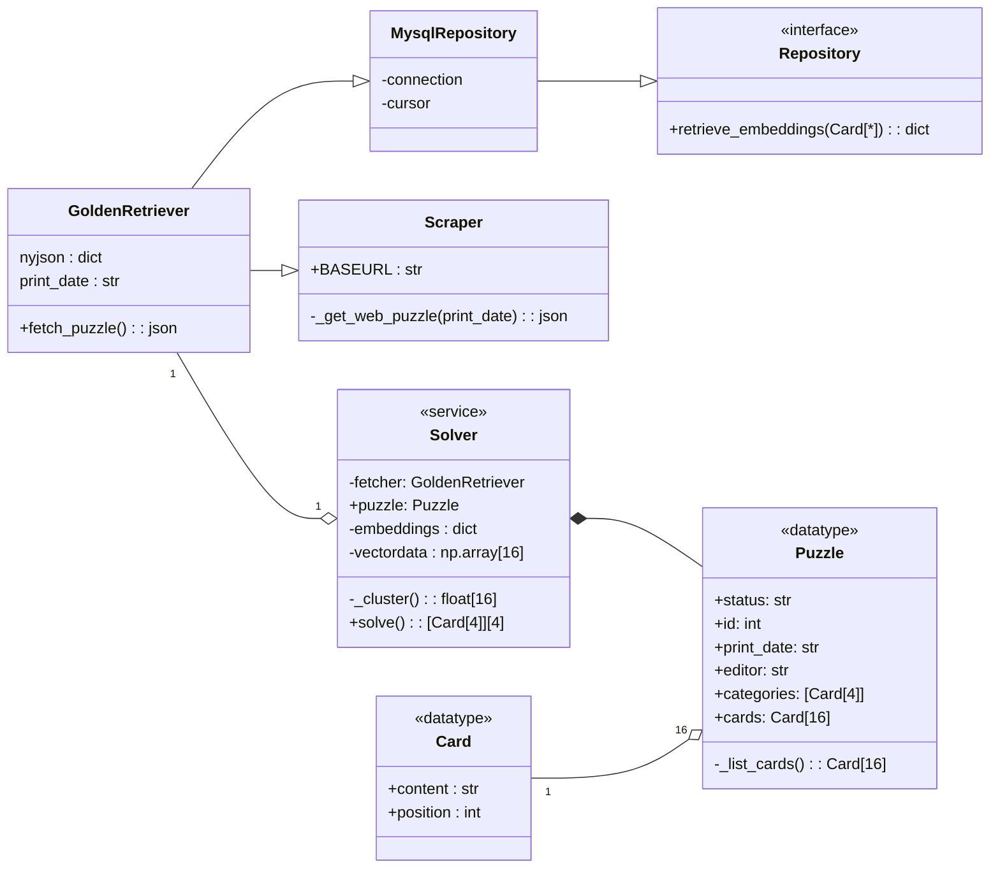

## `connector`: An NYT Games Connections Solver

The objective of this project is to create an automated solver for the New York
Times daily *Connections* puzzle.
Thus the primary use case is to collect the puzzle information for a given date
and output a classification of each of the puzzles "cards."  

The present mechanism for generating the solution is a k-means classification
using pre-trained embeddings
[from the Stanford GloVe project](https://nlp.stanford.edu/projects/glove/).  
This k-means grouping does **not** reliably generate the correct puzzle solution.

### Setup

```bash
# Install dependencies
pip install -r requirements.txt
# Create and run database
docker-compose up
# Start flask server
python -m flask --app app.py run
```

### Web interface

In the web interface (`http://localhost:5000`), select a date and click Solve.
The page will display that date's words, grouped in rows, vaguely mimicking
the actual game's grouping of cards into rows.

The range of dates is restricted (manually, at the moment) to July 2025.
The reason for this is that the range of puzzles available to be solved is
limited by the range of word embeddings available in the database repository,
which is in turn limited by the sheer size of that data,
for which reason only the words from July 2025 are initialized in the database.

### REST API

The API can be called directly with a GET request to
`http://localhost:5000/<date>`,
where the date is in ISO8601 YYYY-MM-DD format.  

As above, only July 2025 is available; other dates will return a 500 error.

### Future Development

Future developments may include:

* different `Solver`s for varied approaches to calculating a solution.
* a comparison (individually or in aggregate) of `connector`'s success rate of
correctly-solved puzzles.
* dynamic collection of word embeddings (may not be directly possible, given
that GloVe embeddings appear to be provided only in a compressed zip file).


### Class Diagram


