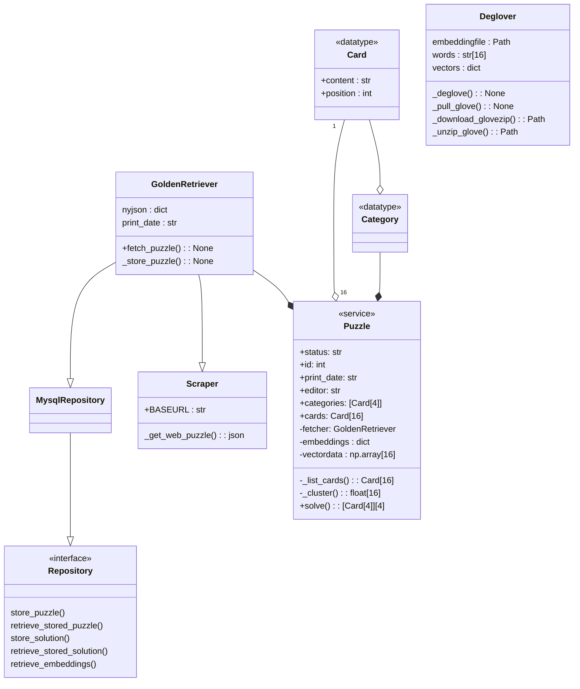

## `connector`: An NYT Games Connections Solver

The objective of this project is to create an automated solver for the New York
Times daily *Connections* puzzle.  
The intended mechanism for generating the solution is to classify the words in
the puzzle using pre-trained embeddings (as of writing,
[embeddings used are from GloVe](https://nlp.stanford.edu/projects/glove/)).

The primary use case is to collect the puzzle information for a given date
and output a classification of each of the puzzles "cards."

Future developments may include:

* a UI to provide said date.
* a comparison (indiviually or in aggregate) of `connector`'s success rate of
correctly-solved puzzles.

